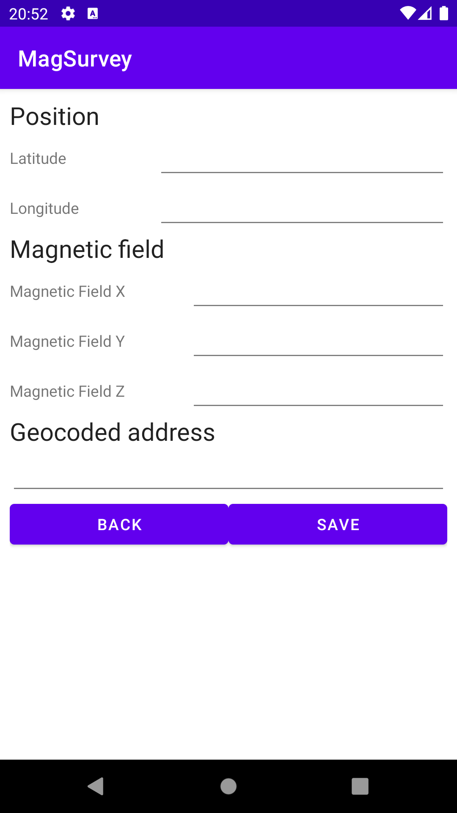
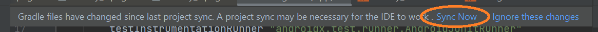

# Android ENSG : MagSurvey

## Introduction

Dans ce TP noté, nous allons revoir tout ce qui a été dit et effectué durant le cours, donc si vous avez bien suivi, ça devrait jouer (expression romande inside).
Il vous est demandé de réaliser une application complète et utilisable.

### Vous devez :
- Créer une application qui compile et s'exécute
- Vous avez toute la journée, de 9h du matin à 15h30
- Copier le devoir sur repertoire partagé de l'école à 15h30 **uniquement**

### Vous avez le droit :
- De vous servir du cours
- De poser des questions à Monsieur **Google** en personne, s'il vous répond :-)
- De m'appeler en dernier recours, si vous êtes coincés et que ça ne compile définitivement pas !

## Cahier des charges

Vous devez créer une application de relevé géographique qui s'articule en 4 grandes fonctionnalités :
- Créer une interface utilisateur avec 3 écrans :
  - Une page d'accueil permettant d'aller aux 2 pages suivantes `(2 points)`
  - Un formulaire de saisie d'un **point d'intérêts** `(2 points)`
  - Une carte `(1 point)`
- Créer une base de données non géographique qui gère les points d'intérêt `(3 points)`
- Enrichir le formulaire afin qu'il soit auto rempli :
  - la position (deux champs avec la latitude et la longitude) `(2 points)`
  - le champ magnétique (un champ par dimension) `(2 points)`
  - l'adresse géocodée `(1 point)`
  - optimiser l'utilisation des ressources du téléphone de l'utilisateur (stopper les capteurs lorsque l'application n'est pas en fonction) `(4 points)`
- Instrumenter la base de données pour la basculer en mode Spatial avec [SpatiaRoom](https://github.com/anboralabs/spatia-room) :
  - enregistrer et afficher des points d'intérêt `(3 points)`
- Bonus `(2 points)` enrichir l'application avec vos idées, soyez créatif :wink:

### Partie I : Création de l'interface

> :warning: **Attention :** Dans cette partie du TP, il ne vous est demandé que les **écrans** et la **navigation** entre ceux-ci. Les fonctionnalités seront demandées par la suite.

#### Création du projet

1. Choisissez une activité `Empty Activity` :


2. Configurez votre projet :
   1. appelez-le `MagSurvey` ;
   2. choisissez un nom de package (par exemple `fr.ign.magsurvey`) ;
   3. choisissez un emplacement de sauvegarde (sur `D:\`) ;
   4. sélectionnez le language Java ;
   5. sélectionnez l'API 28: Android 9.0 (Pie).


3. De même que dans le [TP google service](https://github.com/VSasyan/AndroidENSG/tree/master/3_google_services) ajoutez la clé d'API :

```ini
# ...
MAPS_API_KEY=CLEF
```

> :information_source: **Remarque :** La clé est disponible sur formationTemp.

#### Enchaînement des écrans

Ajoutez 2 nouvelles activités, une `FormActivity` qui contiendra le formulaire et une `MapsActivity` qui contiendra la carte.

Les 3 activity auront l'enchaînement suivant :


> :information_source: **Remarque :** Ne perdez pas trop de temps à placer les éléments exactement comme ils sont présentés. L'important c'est que ce soit utilisable :wink: !

#### Accueil

L'écran d'accueil `MainActivity` est l'écran qui s'ouvre au démarrage de l'application, il permet de passer vers les deux écrans suivant afin d'ajouter ou de consulter les points.


#### Formulaire

L'écran de création d'un **point d'intérêt** est un formulaire classique comme vu en cours.
Veuillez à bien utiliser les `Layout`.



> :warning: **Attention :** Le **style** n'est pas obligatoire, seul la mise en place compte.

Le bouton retour du téléphone et un bouton à coder permettent de revenir à l'écran d'accueil.

#### Carte

La carte est une carte classique permettant à l'utilisateur de voir les points enregistrés.

Le bouton retour du téléphone permet de revenir à l'écran d'accueil.


### Partie II : Création de la base de donnée

Pour créer la base de donnée de notre projet, nous allons utiliser la librairie `Room`. [Room](https://developer.android.com/training/data-storage/room?hl=fr) est un ORM (Object Relational Mapping) qui nous abstrait des aspects bas niveau de création et de requêtage des bases de données.

1. Dans un premier temps, il faut ajouter les dépendances dans le fichier `build.graddle` du **module** :

```groovy
dependencies {
    def room_version = "2.5.0"
    implementation "androidx.room:room-runtime:$room_version"
    annotationProcessor "androidx.room:room-compiler:$room_version"

    // Autres dépendances...
}
```

2. Ensuite, pour que la modification soit prise en compte, il faut synchroniser le fichier à l'aide du bandeau contextuel :


3. Puis, en vous aidant de la documentation de [developer.android room](https://developer.android.com/training/data-storage/room?hl=fr#java), créez l'entité suivante :


Il faut créer 2 classes :
- Une pour l'entité (le PoJo qui représente la donnée) ;
- Une pour le DAO (l'abstraction qui spécifie les opération CRUD à effectuer sur la base de donnée).

> DAO signifie **Data Access Object**.
>
> CRUD signifie **Create Read Update Delete**.

> :warning: **Attention :** pour faciliter la création des entités, il faut ajouter l'option `autogenerate=true` à l'annotation `@PrimaryKey`

Comme ceci :
```java
@Entity
public class PointOfInterest {

    @PrimaryKey(autoGenerate = true)
    public int uid;

    // ...
}
```

> :warning: Dans le DAO, vous aurez besoin d'une fonction pour ajouter **un seul** point d'intérêt et d'une autre pour les lister **tous** respectivement appeller **create** et **list_all** respectivement.

4. Ensuite, il faudra créer une nouvelle class `AppDatabase.java` :

```java
@Database(
        entities = {PointOfInterest.class},
        version = 1,
        exportSchema = false
)
// @TypeConverters(GeometryConverters.class) // A conserver pour plus tard, lors de l'utilisation de SpatiaRoom
public abstract class AppDatabase extends RoomDatabase {
    public abstract PointOfInterestDao pointOfInterestDao();
}

```

5. Et enfin, il faut utiliser la base de données dans les activités :
- `FormActivity`, pour sauver les points d'intérêt créés (nous nous chargerons des coordonnées dans la partie III) ;
- `MapsActivity`, pour afficher les points d'intérêt.

```java
    @Override
    protected void onCreate(Bundle savedInstanceState) {
        // ...

        // Instanciation de la DB
        AppDatabase db = Room.databaseBuilder(getApplicationContext(), AppDatabase.class, "magSurvey.sqlite").allowMainThreadQueries().build();
        // Récupération du DAO (à déclarer en attribut)
        pointOfInterestDao = db.pointOfInterestDao();
    }
```

### Partie III : Remplissage du formulaire

A l'aide du [tutoriel Carto](https://github.com/VSasyan/AndroidENSG/blob/master/3_google_services/README.md) et du [tutoriel Capteurs](https://github.com/VSasyan/AndroidENSG/tree/master/5_capteurs#les-capteurs) implémentez le relevé des données GPS et de champ magnétique.

Cela est à ajouter dans le formulaire (FormActivity) afin de pré-remplir le formulaire.

1. Il faudra ajouter les bonnes permissions dans le manifest ;
2. Il faudra demander les permissions d'accès à la position dans la classe Java (pensez au downgrade de la version de `com.google.android.material:material` à `1.4.0` dans le fichier `build.gradle (module)`) ;
3. Ajouter le code qui permet d'être notifié pour mettre à jour le formulaire :
   1. lors d'un changement de coordonnées GPS ;
   2. lors d'un changement de valeur du champ magnétique.
4. Une fois la position connue, vous pouvez la convertir en adresse postale.

Pensez à économiser la batterie de l'utilisateur, c'est à dire à commencer et arrêter le suivi de position et de champ magnétique aux bons moments (c.f. cycle de vie de l'application).

### Partie IV : Base de donnée spatiale

Afin d'avoir la possibilité de sauvegarder les coordonnées géographiques, il est nécessaire de convertir la base de données Sqlite dans sa version spatiale : `SpatiaLite`.
Spatialite est une surcouche qui assure la conversion, l'indexation, ainsi que les calculs des données géographiques.
Comme nous avions utilisé l'ORM `Room` pour accéder à notre base de données, nous allons utiliser `SpatiaRoom` pour convertir celle-ci dans sa version spatiale.

Vous trouverez la documentation de [spatia-room ici](https://github.com/anboralabs/spatia-room)

1. Dans un premier temps, il faut ajouter le repository `jitpack` dans le fichier `settings.gradle` :
```Groovy
dependencyResolutionManagement {
    repositories {
        google()
        mavenCentral()
        // C'est la ligne ci-dessous qui est à ajouter
        maven { url 'https://jitpack.io' }
    }
}
```

2. Dans un second temps, il faut ajouter la dépendance au fichier `build.gradle` du module pour acceder à cette bibliothèque :

```groovy
dependencies {
    // ...
    implementation 'com.github.anboralabs:spatia-room:0.2.9'
}
```

> :warning: **Attention !** il faut bien penser à synchroniser le fichier `gradle` avec le bouton contextuel :
> 

2. Ensuite, il faut remplacer l'objet `databaseBuilder` par celui de `spatia-room` chaque fois qu'il est utilisé par celui-ci :

```java
AppDatabase db = SpatiaRoom.INSTANCE.databaseBuilder(getApplicationContext(), AppDatabase.class, "magSurvey.sqlite").allowMainThreadQueries().build();
```

3. Et enfin, il faut ajouter l'annotation `@TypeConverters` dans la class `AppDatabase` afin d'indiquer comment convertir les données géographiques :

```java
@Database(
        entities = {PointOfInterest.class},
        version = 2, // Augmentez la version pour que la base soit recréée
        exportSchema = false
)
@TypeConverters(GeometryConverters.class) // A dé-commenter
public abstract class AppDatabase extends RoomDatabase {
    public abstract PointOfInterestDao pointOfInterestDao();
}
```

4. Maintenant que vous avez converti votre base de données en base de données spatiale, il vous reste à créer le champ de position dans l'entité PointOfInterest : `public Point position;`.

Soit modifier les entités comme suit :


5. Maintenant que les Entités peuvent sauvegarder des coordonnées, il faut modifier les Activités `MarkerActivity` et `TopologyActivity` respectivement afin de sauvegarder les données géographiques.

> :warning: **Attention!** afin de sauvegarder les données géographiques, il faudra les convertir. En effet, GoogleMap comprend des `LatLng` et spatia-room des `POINT`.

Pour ce faire, j'ai écrit une classe `GeoConverters.java` pour vous aider, que vous pouvez copier dans votre projet :

```java
public class GeoConverters {

    public static final int SRID = 4326;

    // GPS (LatLng) -> BDD (Point)
    public static Point latLng2Point(LatLng latLng) {
        return new Point(latLng.longitude, latLng.latitude, SRID);
    }

    // BDD (Point) -> Carte (LatLng)
    public static LatLng point2LatLng(Point point) {
        return new LatLng(point.getY(), point.getX());
    }
}
```

Enfin, maintenant que notre application est capable de stocker nos coordonnées géographiques, il vous faut les lire et les exploiter dans l'activity `MapsActivity`

Vous pouvez vous aider de la classe `GeoConverters` que je vous ai fournis avec l'utilisation des méthodes `point2LatLng`.


#### Tester le GPS

1. Afin de pouvoir tester les étapes précédentes, vous pouvez lancer les `Extended Controls` de l'émulateur :


2. Ensuite il vous suffit de sélectionner l'onglet `Location` puis `Routes` et enfin de cliquer sur `Import GPX/KLM` :


3. Vous pouvez télécharger le fichier GPX suivant: [Randonnée-Moustier-Sainte-Marie](resources/download/randonnee-moustier.zip)

4. Et enfin, vous pouvez envoyer des données GPS à votre émulateur en cliquant sur le bouton `PLAY ROUTE`:


## Points Bonus

Maintenant que vous avez fini votre application, vous pouvez l'améliorer :
- Changer l’icône par défaut avec une icône que vous pourrez télécharger sur [IconFinder](https://www.iconfinder.com) et la transformer pour votre application Android avec [Android Asset Studio](https://romannurik.github.io/AndroidAssetStudio/icons-launcher.html) ;
- Changer le thème et les couleurs de l'application ;
- Gérer de multiples langues (internationalisation) et créer une traduction ;
- Améliorer le style et le placement des composants dans les vues ;
- Changer les icônes pour les marqueurs ainsi que pour les relevés topographiques ;
- Une page de présentation / a propos / aide ;
- La gestion du zoom de la carte ;
- Acceder aux données météo ou tout autre type d'appel à des API externe ;
- Une aide contextuelle, des tooltips ;
- Des toast pour prévenir l'utilisateur de certaines actions ;
- Ou toute autre idée, soyez créatifs ! :wink: ;

Chaque amélioration se verra rétribuer d'1 ou 2 points, alors bon courage. :smile:

## Rendu

Pour rendre votre travail, utilisez l'explorateur de fichiers Windows pour zipper (ZIP ou 7z) votre dossier **après avoir fermé Android Studio** (clic droit => 7z => Ajouter à "MagSurvey.7z")) :


Renommez alors l'archive selon le modèle "NOM_Prenom.7z" :


Enfin, déposez le fichier sur `\\FormationTemp\IGN2\Android\Rendus`.

**Conservez une copie du fichier en cas de problème.**

## Remerciements

Merci à vous tous d'avoir participé à ce cours, et j'espère que nous vous aurons appris quelques petites choses sur Android et les application mobiles. :-)
Bonne continuation et bonne réussite dans vos projets.

Yann et Valentin
